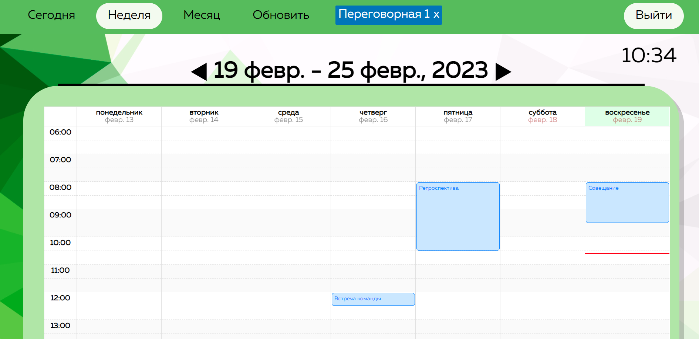

# meeting-room-booking-app

Система для просмотра расписания переговорных комнат.
## Технологический стек
- Java (Spring Boot)
- Angular
## Конфигурация приложения
1. В файле app.module.ts указать url socket сервера (*socketIoConfig*) и client id приложения Microsoft (*MSALInstanceFactory()*).
2. В файле schedule.component.ts (*backendNotificationHandlerUrl*) указать url сервера.
3. В файле SubscriptionController.java (*notificationHost*) указать адрес сервера, на который будут приходить уведомления от Microsoft.
## Как запустить приложение
1. Перейти в папку room-booking-app-backend, написать команду `mvn spring-boot:run`.
2. Перейти в папку room-booking-app-frontend, написать команду `ng serve`.
## Как работает приложение
1. Пользователь авторизируется через аккаунт Microsoft, после чего токен доступа пользователя сохраняется на бекэнде (и обновляется
каждые 5 минут), происходит перенаправление пользователя на экран с расписанием и получение списка переговорных.
2. При выборе переговорной происходит получение её расписания через Microsoft Graph, подключение к socket комнате,
соответствующей данной переговорной и создание подписки на данную переговорную.
3. Каждую минуту происходит продление подписок, при этом подписки тех переговорных, расписание которых никто не просматривает, удаляются.
4. При изменении расписания переговорной со стороны Microsoft приходит уведомление об этом на бекэнд, где определяется, к
какой переговорной относится уведомление, и происходит отправка socket события уведомления в socket комнату, соответствующую
переговорной.
5. При отмене выборе переговорной, клиент отключается от соответствующей ей socket комнаты.
## Переход на использование комнат Microsoft 365
На текущем этапе, приложение не использует комнаты организации, созданные через Microsoft 365. Вместо этого, для
хранения расписания используются календари авторизированного пользователя Microsoft. Примерный план исправлений для того, чтобы использовать
расписание комнат организаций:
1. Перейти на авторизацию не по токену доступа пользователя, а по секретному ключу приложения. Так как при использовании
комнат Microsoft 365 [достаточно](https://learn.microsoft.com/en-us/graph/outlook-get-free-busy-schedule#:~:text=getSchedule%20supports%20both%20delegated%20and%20app%2Donly%20scenarios)
app-only разрешений, то можно не использовать токены доступа пользователей, а использовать только один токен доступа, для
организации (tenant) в целом *(см. пример получения app-only токена доступа в классе GraphClientHelper.java)*.
2. Изменить эндпоинт calendars на getSchedule при получении списка переговорных (*метод callCalendars в schedule.component.ts*) и при получении
расписания через Microsoft Graph (*метод callEvents в schedule.component.ts*).

